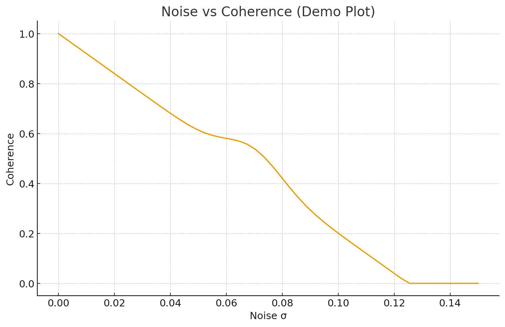

---

# PHASE ENGINE — Transport-Free Compute (RCIRCUIT)

[🎥 **Phase Engine Intro**](final_video%20(78).mp4)

---

## 1. Overview

A compute paradigm where **values never move** —  
only **local phase evolution** performs computation.

The real bottleneck = movement  
The real cost = electricity  
The real failure mode = physics  

---

## 2. Noise–Coherence Curve

---

## 3. Why Phase Computing Matters

Modern AI collapses under **physics**, not math.

Transport dominates:

- movement  
- synchronization  
- memory traffic  

Physics pushes back:

- HBM saturation  
- interconnect latency  
- wire delay  
- coherence loss  

---

## 4. RCIRCUIT: The Core Idea

A compute model where:

- values never move  
- compute happens through local phase evolution  
- no global sync exists  

Transport → expensive  
Local evolution → scalable  

---

## 5. Core Compute Equation

Compute_E = (PhaseAmplitude × CouplingStrength) / PropagationTime

yaml
코드 복사

---

## 6. Minimal Architecture

### RCIRCUIT Cell
phase
delta
coupling

shell
코드 복사

### Update Rule
delta(t+1) = γ Σ(phase_j – phase_i)
phase(t+1) = phase(t) + α · delta(t+1)

shell
코드 복사

### PDE Form
∂φ/∂t = α ∇²φ + γ R(φ)

코드 복사
← 이 마지막 닫힘이 핵심 (코드블록 확실히 종료)

yaml
코드 복사

---

👇 **여기부터는 절대 빨려들지 않는다**

---

## 7. What RCIRCUIT Removes

❌ tensor transport  
❌ global sync  
❌ long-distance propagation  

Replaced by:

✅ local resonance coupling  
✅ Δ-signal transitions  
✅ phase registers  
✅ coherence evolution  

---

## 8. Experiment Suite (1–20)

### Core Experiments (1–10)
- drift  
- coherence  
- resonance  
- threshold logic  
- noise interaction  

### Advanced Experiments (11–20)
- large-grid PDE  
- stability mapping  

Files:
01_phase_xor.txt
02_local_coherence_sim.txt
03_resonance_drift_test.txt
04_threshold_gate_scan.txt
05_coupling_sweep.txt
06_coherence_decay.txt
07_phase_spread (internal)
08_phase_lock_fail (internal)
09_transport_zero_test (internal)
10_noise_resonance_interaction.txt
11–20_*.json

yaml
코드 복사

---

## 9. Phase XOR Gate (PoC)
Δφ = |φ₁ – φ₂|
XOR = 1 if Δφ > θ

makefile
코드 복사

Run:
python src/phase_xor_poc_v01.py

yaml
코드 복사

---

## 10. Scaling & Cost Model

### Transport Cost
| Operation | MatMul | RCIRCUIT |
|----------|--------|----------|
| Move | 100 | 0 |
| Multiply | 1 | 0.4 |
| Local update | — | 0.1 |

### Scaling
MatMul: O(N²)
RCIRCUIT: O(N)

yaml
코드 복사

Transport collapse at **N ≈ 10⁸**.

---

## 11. Commercial Impact

Eliminates:

- energy per token  
- cooling load  
- interconnect burden  

Enables:

- hyperscale AI  
- low-power inference  
- edge compute  

---

## 12. Collaboration Call

Seeking collaborators:

- PDE researchers  
- hardware labs  
- GPU/TPU architects  
- PhD/postdocs  

Contact:  
📩 **jspchp638@gmail.com**

---

Compute where values never move.  
Local physics *is* compute.

---
